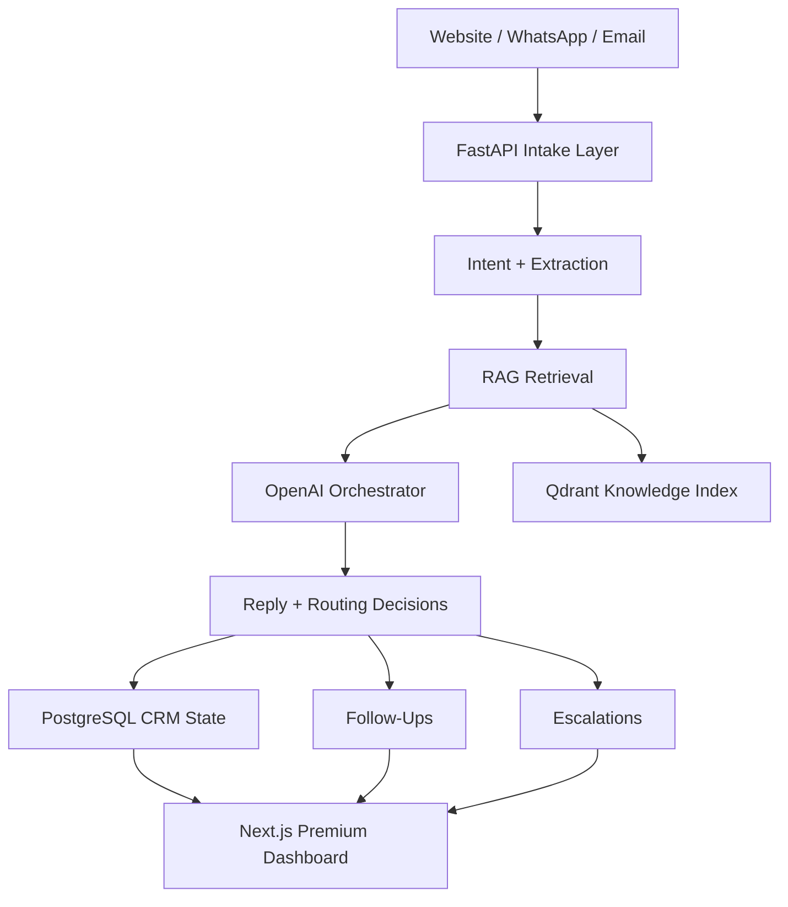

<div align="center">
  
</div>

<div align="center">

# Aurevia Estate AI

### Premium real estate lead automation for modern brokerages and PropTech teams

Capture, qualify, enrich, and route inbound real estate demand across website, WhatsApp, and email through a polished AI operations platform designed to feel like a real SaaS product, not a prototype.

[](./frontend)
[](./backend)
[](https://openai.com)
[](#deployment)
[](#demo-mode)
[](#portfolio-readiness)

[](https://typescriptlang.org)
[](https://python.org)
[](https://postgresql.org)
[](https://qdrant.tech)
[](https://tailwindcss.com)
[](https://docker.com)

</div>

## Product Snapshot

**Aurevia Estate AI** is a portfolio-grade AI operations platform for real estate teams. It turns fragmented inbound demand into a structured sales workflow:

- capture messages from multiple channels
- qualify buyer or renter intent with AI
- enrich every conversation with RAG-backed context
- schedule follow-ups automatically
- escalate sensitive or high-value cases to humans
- give the team a premium command center to manage everything

The product is intentionally presentation-ready:

- premium landing and dashboard UI
- production-shaped backend architecture
- demo fallback mode so the interface stays full even without a live backend
- deployment-ready configs for frontend and backend hosting

## Screenshots

### Dashboard


### Conversation Workspace


## Features

### AI Lead Operations

- multi-channel intake from website, WhatsApp, and email
- intent detection, structured extraction, and reply generation
- RAG document ingestion with vector search through Qdrant
- automated follow-up scheduling and escalation triggers

### Premium Admin Product

- recruiter-impressive dashboard and data-rich detail pages
- polished loading, empty, and error states
- subtle motion, hover states, and micro-interactions
- last-updated indicators and runtime status surfaces

### Demo and Portfolio Readiness

- `NEXT_PUBLIC_DEMO_MODE` support for demo-safe fallbacks
- full mock-backed product behavior when backend services are unavailable
- deployment manifests for Vercel, Render, and Railway workflows
- cleaned env templates with no required hardcoded local values

## Demo Mode

Phase 4 adds a real demo runtime instead of brittle placeholder content.

`NEXT_PUBLIC_DEMO_MODE` supports:

- `off`: frontend uses only the live backend
- `fallback`: tries live APIs first, then falls back to rich demo data if the backend is unreachable
- `force`: always runs with mock data for presentations, recruiter demos, and portfolio walkthroughs

Frontend example:

```env
NEXT_PUBLIC_API_BASE_URL=http://localhost:8000
NEXT_PUBLIC_DEMO_MODE=fallback
```

## Architecture



## Stack

| Layer | Technology | Notes |
| --- | --- | --- |
| Frontend | Next.js 14, TypeScript, Tailwind CSS | App Router dashboard and landing experience |
| Backend | FastAPI, Pydantic, SQLAlchemy | Production-shaped API and orchestration layer |
| AI | OpenAI GPT-4o, text-embedding-3-small | Intent, extraction, response, and retrieval |
| Data | PostgreSQL, Qdrant | Operational storage and vector search |
| Infra | Docker Compose, Vercel, Render, Railway | Local dev and deployment flexibility |

## Local Development

### 1. Clone and configure

```bash
git clone https://github.com/yourusername/aurevia-estate-ai.git
cd aurevia-estate-ai
cp .env.example .env
cp backend/.env.example backend/.env
cp frontend/.env.example frontend/.env.local
```

### 2. Run with Docker

```bash
docker compose up --build
```

### 3. Run manually

Backend:

```bash
cd backend
pip install -r requirements.txt
uvicorn app.main:app --reload --port 8000
```

Frontend:

```bash
cd frontend
npm install
npm run dev
```

## Deployment

### Frontend on Vercel

- root can remain the monorepo
- Vercel should build the `frontend` app
- `vercel.json` is included for a clean monorepo deployment path

### Backend on Render or Railway

- `render.yaml` is included for Render web service deployment
- `railway.json` is included for Railway deployment
- set production env vars for database, OpenAI, Qdrant, and channel credentials

### Environment Notes

Important runtime variables:

- `NEXT_PUBLIC_API_BASE_URL`
- `NEXT_PUBLIC_DEMO_MODE`
- `DATABASE_URL`
- `ALEMBIC_DATABASE_URL`
- `QDRANT_URL`
- `OPENAI_API_KEY`
- `CORS_ORIGINS`

## Portfolio Readiness

Phase 4 focuses on what makes the repo impressive in a recruiter, client, or hiring-manager review:

- polished README and visual identity
- always-presentable UI through demo fallback mode
- refined loading, error, and empty states
- deployment-ready frontend and backend setup
- cleanup of environment and presentation layers without rebuilding core features

## Project Structure

```text
aurevia-estate-ai/
├── backend/
├── frontend/
├── docs/
│   └── assets/
├── docker-compose.yml
├── render.yaml
├── railway.json
└── vercel.json
```

## License

[MIT](LICENSE)
