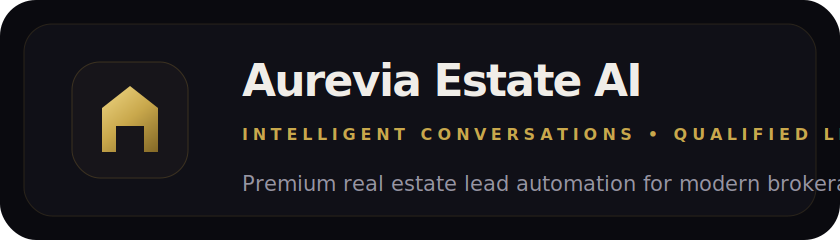
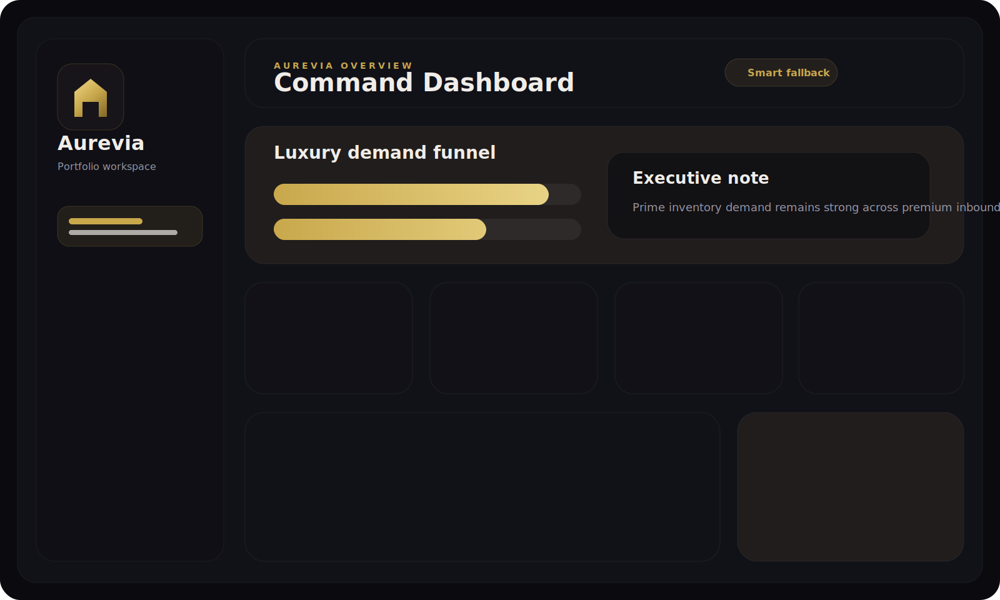
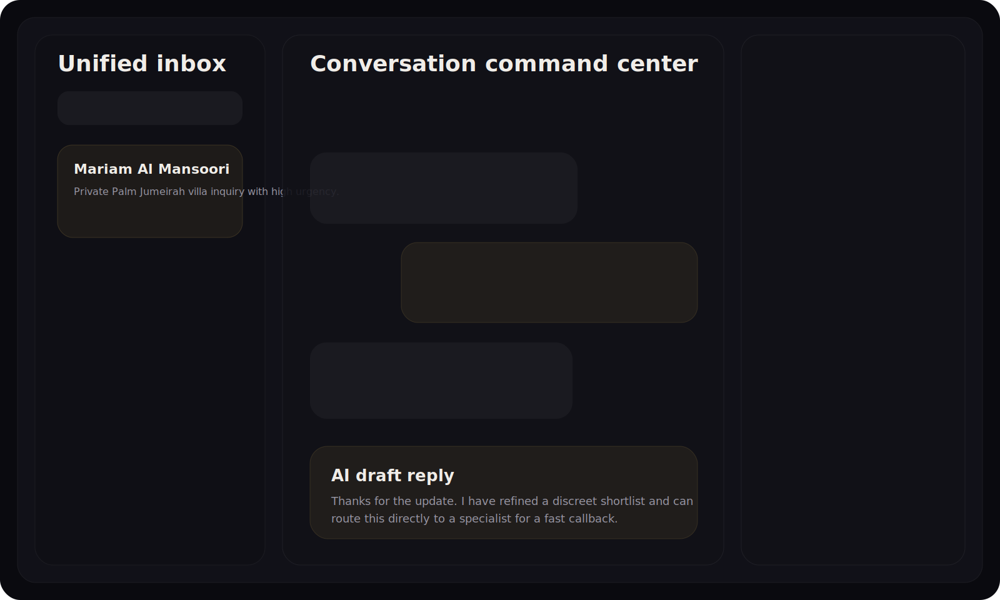

<div align="center">



<br />

# Aurevia Estate AI

### Intelligent Conversations. Qualified Leads. Closed Deals.

**AI-native lead automation for real estate — built to production standard.**

<br />

<p>
  
  
  
</p>

<p>
  
  
  
  
  
  
  
</p>

**Live Frontend:** [https://aurevia-estate-ai.vercel.app/](https://aurevia-estate-ai.vercel.app/)

</div>

---

## 🏛 What It Is

A full-stack AI brokerage platform that converts fragmented inbound interest — from WhatsApp, email, and web — into structured, routed, qualified leads. Every layer is production-shaped: real models, real databases, real orchestration logic.

---

## 🧠 AI System Flow

```
[ Inbound Channels ]  ──────────────────────────────────────────
  Website · WhatsApp · Email
         │
         ▼
[ Intelligence Layer ]  ────────────────────────────────────────
  Intent extraction · Entity recognition · Budget / location / type
         │
         ▼
[ Orchestration Engine ]  ──────────────────────────────────────
  GPT-4o orchestrator · Tool selection · RAG context retrieval
         │
    ┌────┴────────────────────────────────────────────┐
    ▼                    ▼                            ▼
[ Action System ]   [ Knowledge Index ]         [ CRM Layer ]
  Lead creation       Qdrant vectors              PostgreSQL
  Follow-up queue     Brokerage docs              Lead records
  Escalation logic    Market context              Conversation state
    │
    ▼
[ Command Center ]  ────────────────────────────────────────────
  Premium dashboard · Analytics · Knowledge ops · Settings
```

---

## ⚡ Core Capabilities

**🚀 AI Lead Engine**
- Captures demand from website, WhatsApp, and email in real time
- Extracts structured data — intent, budget, location, property type — from natural language
- Generates agent-grade replies via GPT-4o orchestration

**🧠 RAG Intelligence Layer**
- Upload, chunk, embed, and index brokerage documents
- Text extraction pipeline for TXT, MD, JSON, CSV (PDF/DOCX extension points)
- Qdrant vector store with cosine similarity retrieval

**📊 Operations Command Center**
- Lead pipeline with qualification confidence scores
- Conversation threads with AI response quality visibility
- Escalation routing for high-intent buyers
- Follow-up automation queue with scheduled delivery

**🔗 Multi-Channel Integration Layer**
- WhatsApp webhook receiver and test-send flows
- Email channel with outbound queue support
- CRM sync and integration health monitoring

---

## 🖥 Product Surfaces

<table>
  <tr>
    <td width="60%">
      
    </td>
    <td width="40%" valign="top">
      <br />
      <strong>Command Center</strong>
      <br /><br />
      Cinematic dark dashboard. Pipeline visibility, escalation routing, analytics, and RAG operations — from one premium workspace.
    </td>
  </tr>
  <tr>
    <td width="60%">
      
    </td>
    <td width="40%" valign="top">
      <br />
      <strong>Conversation Engine</strong>
      <br /><br />
      Cross-channel thread review with intent context, AI response quality, and lead qualification state.
    </td>
  </tr>
</table>

---

## 🏗 Stack

| Layer | Technology |
|---|---|
| **Frontend** | Next.js 14 · TypeScript · Tailwind CSS · App Router · Geist |
| **Backend** | FastAPI · Pydantic v2 · SQLAlchemy 2 async · Alembic |
| **AI** | GPT-4o · text-embedding-3-small · RAG orchestration |
| **Data** | PostgreSQL 16 · Qdrant vector DB |
| **Infra** | Docker Compose · Vercel · Render · Railway |

---

## 🔁 Demo Mode

The frontend ships with a **resilient demo runtime** — fully presentable without a live backend.

```env
NEXT_PUBLIC_DEMO_MODE=force      # always demo data — recruiter/portfolio mode
NEXT_PUBLIC_DEMO_MODE=fallback   # live-first, auto-falls back if backend is down
NEXT_PUBLIC_DEMO_MODE=off        # live backend only
```

## 🌐 Live Deployment

- **Production frontend:** [https://aurevia-estate-ai.vercel.app/](https://aurevia-estate-ai.vercel.app/)

---

## 🚀 Quick Start

```bash
# Clone
git clone https://github.com/zohair-azmat-ai/Aurevia-Estate-Ai.git
cd aurevia-estate-ai

# Configure
cp .env.example .env
cp backend/.env.example backend/.env
cp frontend/.env.example frontend/.env.local

# Run (Docker)
docker compose up --build
```

**Manual:**

```bash
# Backend
cd backend && pip install -r requirements.txt
uvicorn app.main:app --reload --port 8000

# Frontend
cd frontend && npm install && npm run dev
```

**Key environment variables:**

```
OPENAI_API_KEY · DATABASE_URL · QDRANT_URL
NEXT_PUBLIC_API_BASE_URL · NEXT_PUBLIC_DEMO_MODE
```

---

## 📁 Structure

```
aurevia-estate-ai/
├── backend/          FastAPI · models · services · RAG · API
├── frontend/         Next.js · dashboard · landing · components
├── docs/             Architecture assets
├── docker-compose.yml
├── render.yaml
└── railway.json
```

---

## 💡 Why This Project

- End-to-end product thinking: UI system design → backend orchestration
- AI application depth: extraction, routing, retrieval, escalation — not just chat
- Production-shaped architecture: async ORM, Alembic migrations, vector DB, typed API client
- Luxury SaaS interface quality with demo resilience built in
- Clear domain framing: real estate operations, lead qualification, brokerage automation

---

<div align="center">

**[MIT License](LICENSE)** · Built with precision for portfolio demonstration


</div>
