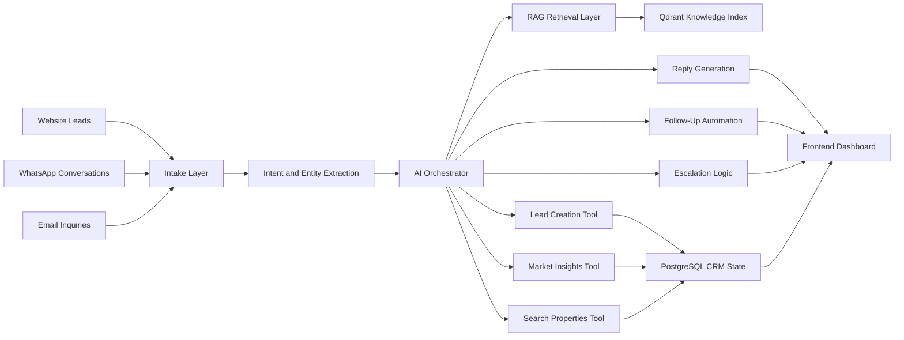

<div align="center">
  
</div>

<div align="center">

## Aurevia Estate AI

### Premium AI Command Center for Real Estate Demand, Qualification, and Routing

Turn fragmented inbound interest into structured leasing and sales momentum across website, WhatsApp, and email with a product designed to look and feel like a venture-backed PropTech SaaS platform.

<p>
  
  
  
</p>

<p>
  
  
  
  
  
  
  
</p>

</div>

---

## Product Statement

**Aurevia Estate AI** is a premium brokerage automation system built to capture, qualify, enrich, and route real estate demand through a single AI-led operating layer.

It combines:

- **inbound channel intake** for website, email, and WhatsApp workflows
- **LLM-powered conversation intelligence** for qualification and response generation
- **RAG-backed knowledge retrieval** for grounded answers and document context
- **lead creation and escalation logic** for high-intent buyer or renter journeys
- **a polished admin command center** that feels portfolio-ready, not prototype-grade

This repository is intentionally built to showcase both **product taste** and **system thinking**.

---

## Why It Stands Out

| Surface | What It Delivers |
| --- | --- |
| **AI Orchestration** | Extracts intent, location, budget, and property preferences from natural language conversations |
| **Qualified Demand Engine** | Converts raw inbound messages into structured lead records, follow-ups, and escalations |
| **Knowledge Layer** | Supports RAG ingestion and retrieval over brokerage documents and market context |
| **Operations Dashboard** | Presents the workflow through a premium dark-luxury interface designed for demos and portfolio reviews |
| **Demo Readiness** | Keeps the frontend full and presentable through controlled demo fallbacks when backend services are unavailable |

---

## Capability Highlights

### AI-Powered Leasing and Sales Workflow

- capture inbound demand from multiple channels
- interpret buyer or renter intent from natural language
- extract structured lead data such as budget, location, and property type
- generate agent-style replies and workflow decisions
- escalate high-value demand into priority handling paths

### Premium SaaS Presentation Layer

- cinematic dark dashboard with luxury gold accents
- polished loading, empty, and error states
- glassmorphism, layered panels, and premium product framing
- recruiter-friendly landing page and dashboard experience

### Deployment and Demo Confidence

- `NEXT_PUBLIC_DEMO_MODE` for resilient frontend demos
- deployment scaffolding for Vercel, Render, Railway, and Hugging Face Space workflows
- environment templates prepared for local development and hosted deployment

---

## Product Surfaces

<table>
  <tr>
    <td width="60%">
      
    </td>
    <td width="40%">
      <strong>Operations Command Center</strong><br />
      A premium admin workspace for pipeline visibility, lead routing, escalations, analytics, and knowledge operations.
    </td>
  </tr>
  <tr>
    <td width="60%">
      
    </td>
    <td width="40%">
      <strong>Conversation Intelligence Workspace</strong><br />
      Structured thread review with lead context, intent handling, and automation-aware response flows.
    </td>
  </tr>
</table>

The live product also includes a premium landing surface and floating AI chat experience aligned with the same dark luxury system.

---

## AI Workflow and Architecture



### Layer View

| Layer | Role |
| --- | --- |
| **Inbound Layer** | Receives demand from website, WhatsApp, and email channels |
| **AI Layer** | Extracts intent and entities, generates responses, and drives workflow decisions |
| **Action Layer** | Searches properties, creates leads, triggers follow-ups, and escalates high-priority cases |
| **Data Layer** | Stores operational CRM state in PostgreSQL and retrieval context in Qdrant |
| **Presentation Layer** | Exposes the system through a polished Next.js dashboard and landing experience |

---

## Tech Stack

| Category | Technologies |
| --- | --- |
| **Frontend** | Next.js 14, TypeScript, Tailwind CSS, App Router |
| **Backend** | FastAPI, Pydantic, SQLAlchemy, Alembic |
| **AI** | OpenAI GPT-4o, embeddings, prompt orchestration, retrieval-augmented generation |
| **Data** | PostgreSQL, Qdrant, SQLite for selected portable deployment scenarios |
| **Infrastructure** | Docker Compose, Vercel, Render, Railway, Hugging Face Spaces |

---

## Demo and Deployment

### Demo Mode

The frontend supports a portfolio-safe runtime when live APIs are unavailable.

`NEXT_PUBLIC_DEMO_MODE` options:

- `off` - frontend uses only the live backend
- `fallback` - live-first behavior with automatic demo fallback if the backend is unreachable
- `force` - always runs on mock data for recruiter demos, walkthroughs, and portfolio reviews

Example:

```env
NEXT_PUBLIC_API_BASE_URL=http://localhost:8000
NEXT_PUBLIC_DEMO_MODE=fallback
```

### Deployment Notes

- **Frontend** is prepared for deployment on Vercel from the `frontend` app directory
- **Backend** can be deployed through Render or Railway using the included root deployment manifests
- **Portable backend demos** can be adapted for Hugging Face Space deployment through the separate deployment repo workflow

Important environment variables:

- `NEXT_PUBLIC_API_BASE_URL`
- `NEXT_PUBLIC_DEMO_MODE`
- `DATABASE_URL`
- `ALEMBIC_DATABASE_URL`
- `QDRANT_URL`
- `OPENAI_API_KEY`
- `CORS_ORIGINS`

---

## Portfolio Value

This project is especially strong as a portfolio piece because it demonstrates:

- **end-to-end product thinking** from UI system design to backend workflow orchestration
- **AI application design** beyond a simple chatbot, including extraction, routing, retrieval, and escalation
- **real SaaS presentation quality** with premium interface polish and demo resilience
- **deployment awareness** across frontend, backend, and portable runtime targets
- **clear domain framing** around real estate operations, lead qualification, and brokerage automation

---

## Local Development

### Clone and configure

```bash
git clone https://github.com/zohair-azmat-ai/Aurevia-Estate-Ai.git
cd aurevia-estate-ai
cp .env.example .env
cp backend/.env.example backend/.env
cp frontend/.env.example frontend/.env.local
```

### Run with Docker

```bash
docker compose up --build
```

### Run manually

Backend:

```bash
cd backend
pip install -r requirements.txt
uvicorn app.main:app --reload --port 8000
```

Frontend:

```bash
cd frontend
npm install
npm run dev
```

---

## Project Structure

```text
aurevia-estate-ai/
|-- backend/
|-- frontend/
|-- docs/
|   `-- assets/
|-- hf-space/
|-- docker-compose.yml
|-- render.yaml
|-- railway.json
|-- .env.example
`-- README.md
```

---

## License

[MIT](LICENSE)
